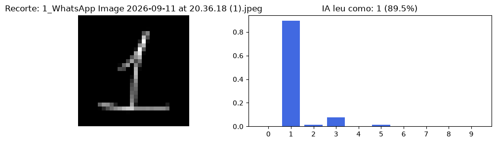
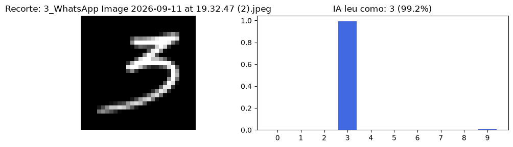
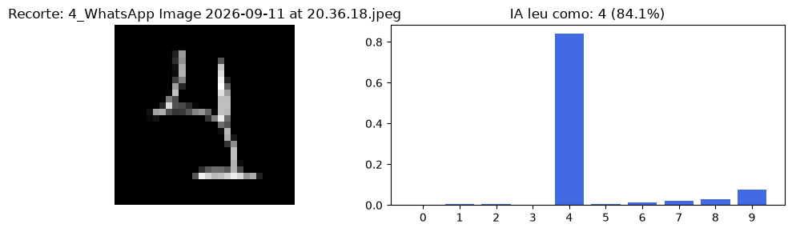
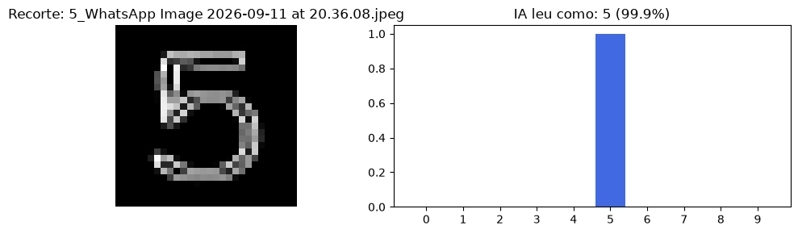
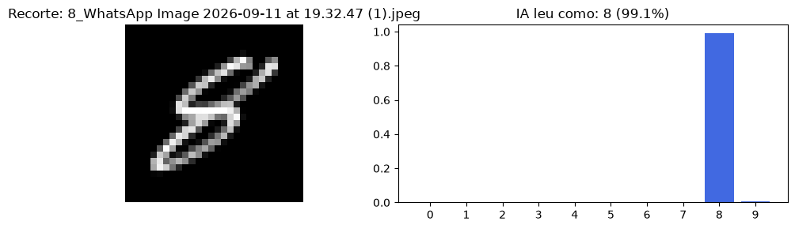

# 🧠 MNIST Predictive Pipeline - Classificação de Dígitos Manuscritos

Um pipeline completo de Machine Learning e Visão Computacional focado em resolver o problema de reconhecimento automatizado de dígitos manuscritos. O sistema recebe imagens brutas de caligrafia, processa o sinal visual e utiliza algoritmos preditivos para classificar os números, lidando com ruídos e variações morfológicas.

## 🚀 Escopo do Projeto e Funcionalidades

O desenvolvimento técnico foi estruturado em cinco fases de complexidade progressiva:

*   **Fase 1: Análise Exploratória (EDA):** Carregamento do dataset MNIST, validação do balanceamento de classes e plotagem visual das matrizes bidimensionais de intensidade de pixels mapeadas para vetores de 784 features.
*   **Fase 2: Pré-processamento:** Divisão estratificada dos dados (Treino/Teste) e normalização matemática dos tensores para a escala [0.0, 1.0].
*   **Fase 3: Modelagem Preditiva:** Treinamento e ajuste justificado de hiperparâmetros de três modelos distinots: Regressão Logística, Random Forest e Rede Neural Artificial (MLP).
    * **Otimização de Performance:** Utilização de `GridSearchCV` para busca de hiperparâmetros e `Early Stopping` para prevenção de *overfitting* e otimização de custo computacional.
*   **Fase 4: Avaliação Comparativa:** Extração de matrizes de confusão e relatório de métricas (Acurácia, Precisão, Recall e F1-Score ponderados) para mapear o impacto computacional e deficiências topológicas do melhor modelo.
*   **Fase 5: Testes de Generalização Extrema:**
    *   *Class Masking:* Treinamento restrito com ocultação de classes.
    *   *Inferência OOD (Out-of-Distribution):* Teste de estresse forçando classificações de dígitos nunca vistos para debater a "falsa certeza" (*overconfidence*) da IA.
    *   *Inferência no Mundo Real:* Criação de um pipeline com OpenCV (inversão, bounding box e normalização) para ler fotografias de caligrafias próprias. Mapeamento de vulnerabilidades espaciais (Domain Shift e similaridade morfológica).

## 🛠️ Tecnologias e Técnicas Utilizadas

*   **Linguagens & Ambientes:** Python 3, Jupyter Notebook.
*   **Bibliotecas Preditivas:** `scikit-learn`, `TensorFlow/Keras`.
*   **Visão Computacional & Matrizes:** `OpenCV`, `NumPy`.
*   **Visualização:** `Matplotlib`, `Seaborn`.

## 📊 Resultados do Modelo







## 📦 Como Executar o Projeto

1. **Clone o repositório:**
   ```bash
   git clone https://github.com/raphaelpiresdev-ai/MNIST-Predictive-Pipeline.git
   cd MNIST-Predictive-Pipeline
   ```

2. **Prepare o ambiente virtual e dependências:**
   Gere o ambiente e instale as bibliotecas baseadas no `requirements.txt` para garantir a reprodutibilidade exata do laboratório.
   ```bash
   # Criar o ambiente virtual
   python -m venv .venv

   # Ativação (Windows)
   .venv\Scripts\activate

   # Ativação (Linux/Mac)
   source .venv/bin/activate

   # Instalar dependências
   pip install -r requirements.txt
   ```

3. **Estrutura de Dados Locais:**
   O código utiliza caminhos relativos. Certifique-se de que as fotos digitalizadas (Fase 5.3) estejam organizadas na pasta `minhas_imagens/`, localizada na raiz do diretório do projeto.

4. **Execução:**
   Você pode executar o arquivo `main.ipynb` de duas formas:
   * **Via VS Code (Recomendado):** 
     Abra a pasta do projeto no VS Code, abra o arquivo `main.ipynb`, clique em **Select Kernel** no canto superior direito e escolha o interpretador Python do seu ambiente virtual (`.venv`). Depois, basta rodar as células.
   * **Via Navegador (Terminal):** 
     Com o ambiente virtual ativado no seu terminal, certifique-se de que o pacote `notebook` está instalado e inicie o servidor:
     ```bash
     # Instalando o pacote notebook
     pip install notebook

     # Iniciando o notebook
     jupyter notebook
     ```

## 🔮 Melhorias Futuras

*   **Data Augmentation:** Aplicar transformações morfológicas (afinamento, engrossamento e rotacionamento) nas imagens de treino originais para aumentar a imunidade do modelo a *Domain Shifts* causados por diferentes espessuras de canetas no mundo real.
*   **Redes Convolucionais:** Migrar a arquitetura clássica para uma CNN, otimizando a leitura espacial 2D e mitigando o impacto de ruídos como linhas de caderno.

## 🎥 Apresentação em Vídeo

[▶️ Clique aqui para acessar a apresentação do projeto no Google Drive](https://drive.google.com/drive/folders/1u7Iw_2byr9aby8F_UvX8s_iHIWsyPSBP?usp=drive_link)

*(O vídeo cobre o funcionamento da aplicação, arquitetura de versionamento do GitHub via branch develop e justificativas de arquitetura)*

## 👤 Autor

**Raphael Pires** - [@raphaelpiresdev-ai](https://github.com/raphaelpiresdev-ai)
*   **GitHub:** [github.com/raphaelpiresdev-ai](https://github.com/raphaelpiresdev-ai)
*   **Email:** raphaelpiresdev@gmail.com
